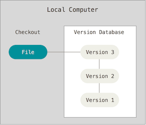
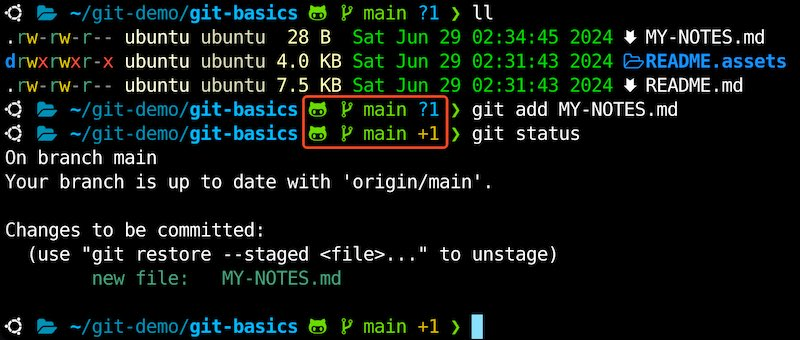

## Git Basics

 

This repository serves as a demonstration of Git, based on the book [Pro Git 2nd Edition](https://github.com/progit/progit2/) available at https://git-scm.com/book/en/v2. It is recommended to read Chapters 1, 2, 3, 5, and 6 to grasp the fundamentals of Git.

### About Versions Control

https://git-scm.com/book/en/v2/Getting-Started-About-Version-Control

#### Local Version Control Systems

 

#### Centralized Version Control Systems

 

#### Distributed Version Control Systems

 


### What is Git?

https://git-scm.com/book/en/v2/Getting-Started-What-is-Git%3F

> Other systems (CVS, Subversion, Perforce, and so on) think of the information they store as a set of files and the changes made to each file over time (this is commonly described as *delta-based* version control).

 

> Git thinks about its data more like a **stream of snapshots**.
>
> This makes Git more like a mini filesystem with some incredibly powerful tools built on top of it, rather than simply a VCS.


#### Git Advantages

- Nearly Every Operation Is Local
- Git Has Integrity (SHA1, transition to SHA-256)
- Git Generally Only Adds Data

#### The Three States

> Pay attention now — here is the main thing to remember about Git if you want the rest of your learning process to go smoothly. Git has three main states that your files can reside in: *modified*, *staged*, and *committed*:
>
> - Modified means that you have changed the file but have not committed it to your database yet.
> - Staged means that you have marked a modified file in its current version to go into your next commit snapshot.
> - Committed means that the data is safely stored in your local database.

#### Three main sections of a Git project

The working tree or working directory, the staging area, and the Git directory.


> The working tree is a single checkout of one version of the project. These files are pulled out of the compressed database in the Git directory and placed on disk for you to use or modify.
>
> The staging area is a file, generally contained in your Git directory, that stores information about what will go into your next commit. Its technical name in Git parlance is the “index”, but the phrase “staging area” works just as well.
>
> The Git directory is where Git stores the metadata and object database for your project. This is the most important part of Git, and it is what is copied when you *clone* a repository from another computer.

#### Basic Git Workflow

1. You modify files in your working tree.
2. You selectively stage just those changes you want to be part of your next commit, which adds *only* those changes to the staging area.
3. You do a commit, which takes the files as they are in the staging area and stores that snapshot permanently to your Git directory.

### The Git Command Line

> There are a lot of different ways to use Git. There are the original command-line tools, and there are many graphical user interfaces of varying capabilities. [...] The command line is the only place you can run *all* Git commands — most of the GUIs implement only a partial subset of Git functionality for simplicity. If you know how to run the command-line version, you can probably also figure out how to run the GUI version, while the opposite is not necessarily true.

#### Installing Git

https://github.com/git-guides/install-git

#### First-Time Git Setup

https://git-scm.com/book/en/v2/Getting-Started-First-Time-Git-Setup

Check git version:

```shell
git --version
```

Global configuration

```shell
# Mandatory: Set your user name and email address.
git config --global user.name "John Doe"
git config --global user.email "johndoe@example.com"

# Optional but recommended: Set default branch to main.
git config --global init.defaultBranch main

# Optional. If not configured, Git uses your system’s default editor.
git config --global core.editor vim
# Or
git config --global core.editor nvim
```

> [!TIP]  
> https://jvns.ca/blog/2024/02/16/popular-git-config-options/

Use the `git config --list` command to list all the settings Git can find at that point:

```shell
git config --list
```

```
filter.lfs.required=true
filter.lfs.clean=git-lfs clean -- %f
filter.lfs.smudge=git-lfs smudge -- %f
filter.lfs.process=git-lfs filter-process
user.email=johndoe@example.com
user.name=John Doe
core.editor=nvim
init.defaultbranch=main
...
```

#### Need Help?

```shell
git help <verb>
git <verb> --help
man git-<verb>
```

### Getting a Git Repository

https://git-scm.com/book/en/v2/Git-Basics-Getting-a-Git-Repository

> You typically obtain a Git repository in one of two ways:
>
> 1. You can take a local directory that is currently not under version control, and turn it into a Git repository, or
> 2. You can *clone* an existing Git repository from elsewhere.

#### Initializing a Repository in an Existing Directory

> If you have a project directory that is currently not under version control and you want to start controlling it with Git, you first need to go to that project’s directory. [...] and type:

```
git init
```

> [!TIP]  
> Add a .gitignore file. Templates can be found at https://github.com/github/gitignore

> This creates a new subdirectory named `.git` that contains all of your necessary repository files — a Git repository skeleton. At this point, nothing in your project is tracked yet.
>
> If you want to start version-controlling existing files (as opposed to an empty directory), you should probably begin tracking those files and do an initial commit. You can accomplish that with a few `git add` commands that specify the files you want to track, followed by a `git commit`:

```shell
git add FILE1
git add FILE2
......
# Or
git add .

git commit -m 'Initial project version'
```

#### Cloning an Existing Repository

> If you want to get a copy of an existing Git repository — for example, a project you’d like to contribute to — the command you need is `git clone`. 
>
> You clone a repository with `git clone <url>`. 

For example, if you want to clone this repository, you can do so like this:

```shell
git clone https://github.com/sait-lab/git-basics
```

That creates a directory named `git-basics`, initializes a `.git` directory inside it, pulls down all the data for that repository, and checks out a working copy of the latest version. If you go into the new `git-basics` directory that was just created, you’ll see the project files in there, ready to be worked on or used.

If you want to clone the repository into a directory named something other than `git-basics`, you can specify the new directory name as an additional argument:

```
git clone https://github.com/sait-lab/git-basics ~/my-git-notes
```

That command does the same thing as the previous one, but the target directory is called `my-git-notes`.

Git has a number of different transfer protocols you can use. The previous example uses the `https://` protocol, but you may also see `git://` or `user@server:path/to/repo.git`, which uses the SSH transfer protocol.

> [!TIP]  
> [GitHub Key-Based SSH Authentication](https://github.com/sait-lab/devops/blob/main/GitHub%20Key-Based%20SSH%20Authentication.md)

### Recording Changes to the Repository

https://git-scm.com/book/en/v2/Git-Basics-Recording-Changes-to-the-Repository

#### States of files in your working directory

>each file in your working directory can be in one of two states: *tracked* or *untracked*. Tracked files are files that were in the last snapshot, as well as any newly staged files; they can be unmodified, modified, or staged. In short, tracked files are files that Git knows about.

> Untracked files are everything else — any files in your working directory that were not in your last snapshot and are not in your staging area. When you first clone a repository, all of your files will be tracked and unmodified because Git just checked them out and you haven’t edited anything.

> As you edit files, Git sees them as modified, because you’ve changed them since your last commit. As you work, you selectively stage these modified files and then commit all those staged changes, and the cycle repeats.

 

#### Checking the Status of Your Files

The main tool you use to determine which files are in which state is the `git status` command. If you run this command directly after a clone, you should see something like this:

```
$ git status                                                               ubuntu@kind
On branch main
Your branch is up to date with 'origin/main'.

nothing to commit, working tree clean
```

Add a new file to this project, a simple `MY-NOTES.md` file. If the file didn’t exist before, and you run `git status`, you see your untracked file like so:

```
$ echo 'This file contains my notes' > MY-NOTES.md
$ git status

On branch main
Your branch is up to date with 'origin/main'.

Untracked files:
  (use "git add <file>..." to include in what will be committed)
        MY-NOTES.md

nothing added to commit but untracked files present (use "git add" to track)
```

> Untracked basically means that Git sees a file you didn’t have in the previous snapshot (commit), and which hasn’t yet been staged; Git won’t start including it in your commit snapshots until you explicitly tell it to do so. It does this so you don’t accidentally begin including generated binary files or other files that you did not mean to include.

 
Credit: [Chapter 15 Git Command Line Interface (CLI) | The Shiny AWS Book (business-science.github.io)](https://business-science.github.io/shiny-production-with-aws-book/git-command-line-interface-cli.html)

#### Tracking New Files

Use the command `git add` to track a new file.

```
$ git add MY-NOTES.md
```

If you run your status command again, you can see that your `MY-NOTES` file is now tracked and staged to be committed:

```
git status                                                            ubuntu@kind
On branch main
Your branch is up to date with 'origin/main'.

Changes to be committed:
  (use "git restore --staged <file>..." to unstage)
        new file:   MY-NOTES.md
```

> [!TIP]  
> You can enhance the shell with `git` integration. The screenshot below shows [romkatv/powerlevel10k: A Zsh theme (github.com)](https://github.com/romkatv/powerlevel10k) adds git status to the `zsh` command line prompt.
>
>  

> You can tell that it’s staged because it’s under the “Changes to be committed” heading. If you commit at this point, the version of the file at the time you ran `git add` is what will be in the subsequent historical snapshot. You may recall that when you ran `git init` earlier, you then ran `git add <files>` — that was to begin tracking files in your directory. The `git add` command takes a path name for either a file or a directory; if it’s a directory, the command adds all the files in that directory recursively.


