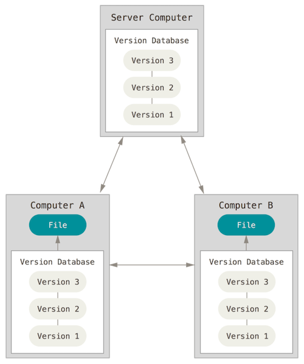
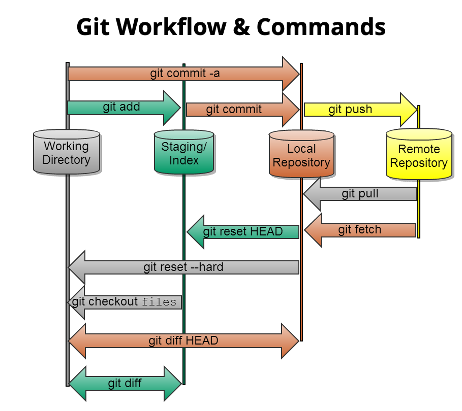
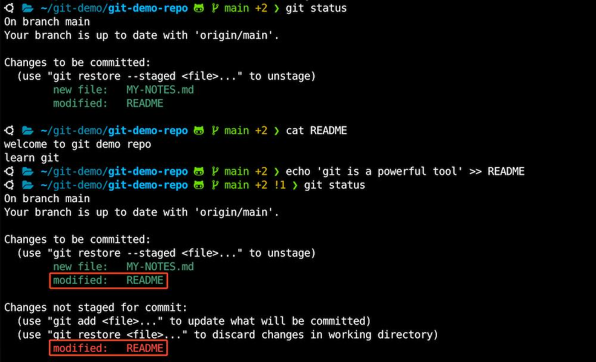
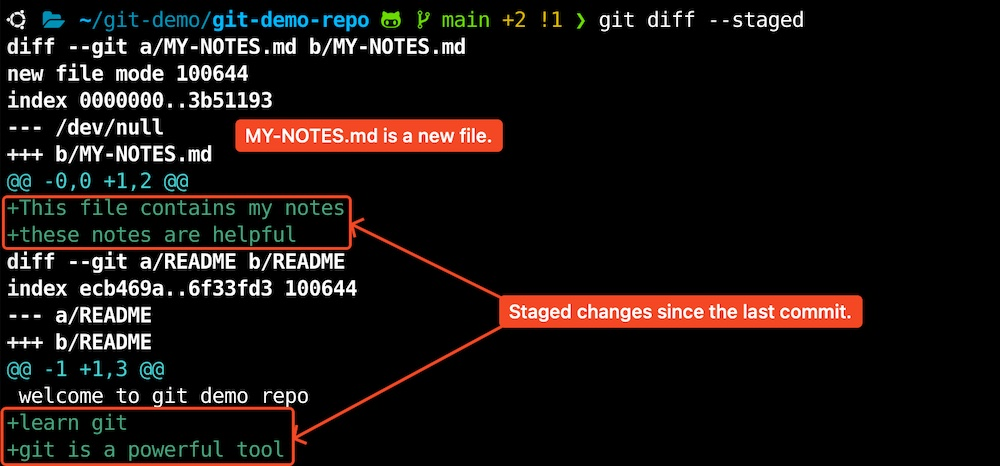
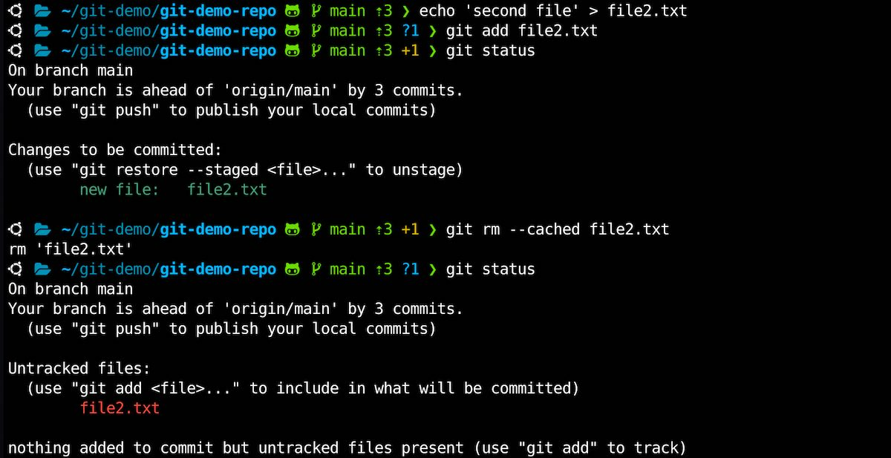
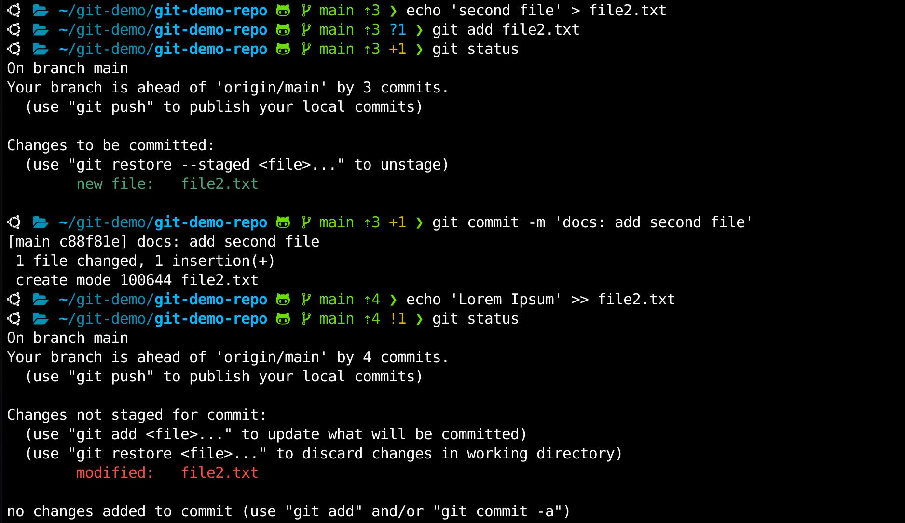
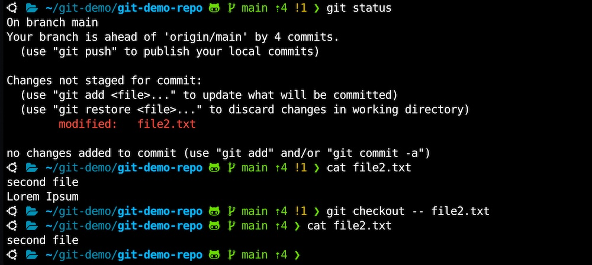
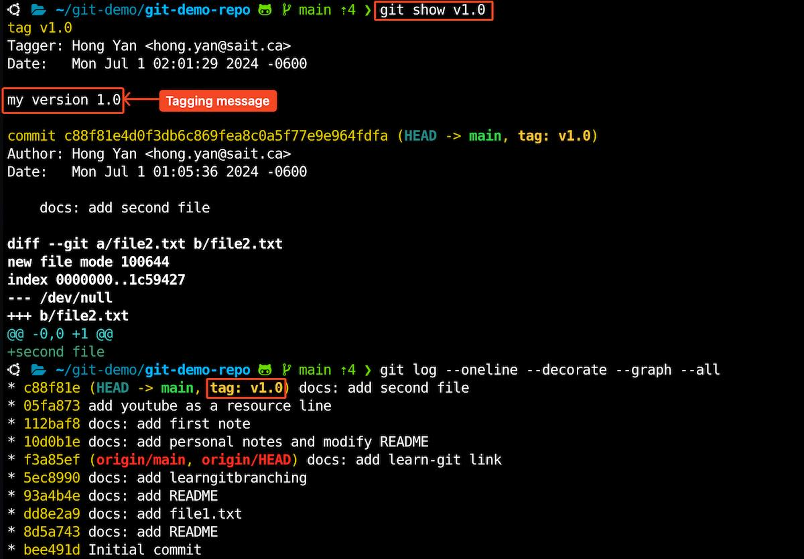

## Git Basics

### Table of Contents

   * [Git Basics](#git-basics)
      * [About Versions Control](#about-versions-control)
         * [Local Version Control Systems](#local-version-control-systems)
         * [Centralized Version Control Systems](#centralized-version-control-systems)
         * [Distributed Version Control Systems](#distributed-version-control-systems)
      * [What is Git?](#what-is-git)
         * [Git Advantages](#git-advantages)
         * [The Three States](#the-three-states)
         * [Three main sections of a Git project](#three-main-sections-of-a-git-project)
         * [Basic Git Workflow](#basic-git-workflow)
      * [The Git Command Line](#the-git-command-line)
         * [Installing Git](#installing-git)
         * [First-Time Git Setup](#first-time-git-setup)
         * [Need Help?](#need-help)
      * [Getting a Git Repository](#getting-a-git-repository)
         * [Initializing a Repository in an Existing Directory](#initializing-a-repository-in-an-existing-directory)
         * [Cloning an Existing Repository](#cloning-an-existing-repository)
      * [Recording Changes to the Repository](#recording-changes-to-the-repository)
         * [States of files in your working directory](#states-of-files-in-your-working-directory)
         * [Checking the Status of Your Files](#checking-the-status-of-your-files)
         * [Tracking New Files](#tracking-new-files)
         * [Staging Modified Files](#staging-modified-files)
         * [Short Status](#short-status)
         * [Ignoring Files](#ignoring-files)
         * [Viewing Your Staged and Unstaged Changes](#viewing-your-staged-and-unstaged-changes)
         * [Committing Your Changes](#committing-your-changes)
         * [Skipping the Staging Area](#skipping-the-staging-area)
         * [Removing Files](#removing-files)
         * [Moving Files](#moving-files)
      * [Viewing the Commit History](#viewing-the-commit-history)
      * [Undoing Things](#undoing-things)
         * [Redo the commit](#redo-the-commit)
         * [Unstaging a Staged File](#unstaging-a-staged-file)
         * [Unmodifying a Modified File](#unmodifying-a-modified-file)
      * [Working with Remotes](#working-with-remotes)
         * [Showing Your Remotes](#showing-your-remotes)
         * [Adding Remote Repositories](#adding-remote-repositories)
         * [Fetching and Pulling from Your Remotes](#fetching-and-pulling-from-your-remotes)
         * [Pushing to Your Remotes](#pushing-to-your-remotes)
         * [Inspecting a Remote](#inspecting-a-remote)
         * [Renaming and Removing Remotes](#renaming-and-removing-remotes)
      * [Tagging](#tagging)
         * [Creating Tags](#creating-tags)
         * [Annotated Tags](#annotated-tags)
         * [Lightweight Tags](#lightweight-tags)
         * [Tagging Later](#tagging-later)
         * [Sharing Tags](#sharing-tags)
         * [Deleting Tags](#deleting-tags)
         * [Checking out Tags](#checking-out-tags)

---

### About Versions Control

https://git-scm.com/book/en/v2/Getting-Started-About-Version-Control

#### Local Version Control Systems

 

#### Centralized Version Control Systems

 

#### Distributed Version Control Systems

 


### What is Git?

https://git-scm.com/book/en/v2/Getting-Started-What-is-Git%3F

> Other systems (CVS, Subversion, Perforce, and so on) think of the information they store as a set of files and the changes made to each file over time (this is commonly described as *delta-based* version control).

 

> Git thinks about its data more like a **stream of snapshots**.
>
> This makes Git more like a mini filesystem with some incredibly powerful tools built on top of it, rather than simply a VCS.


#### Git Advantages

- Nearly Every Operation Is Local
- Git Has Integrity (SHA1, transition to SHA-256)
- Git Generally Only Adds Data

#### The Three States

> Pay attention now — here is the main thing to remember about Git if you want the rest of your learning process to go smoothly. Git has three main states that your files can reside in: *modified*, *staged*, and *committed*:
>
> - Modified means that you have changed the file but have not committed it to your database yet.
> - Staged means that you have marked a modified file in its current version to go into your next commit snapshot.
> - Committed means that the data is safely stored in your local database.

#### Three main sections of a Git project

The working tree or working directory, the staging area, and the Git directory.


> The working tree is a single checkout of one version of the project. These files are pulled out of the compressed database in the Git directory and placed on disk for you to use or modify.
>
> The staging area is a file, generally contained in your Git directory, that stores information about what will go into your next commit. Its technical name in Git parlance is the “index”, but the phrase “staging area” works just as well.
>
> The Git directory is where Git stores the metadata and object database for your project. This is the most important part of Git, and it is what is copied when you *clone* a repository from another computer.

#### Basic Git Workflow

1. You modify files in your working tree.
2. You selectively stage just those changes you want to be part of your next commit, which adds *only* those changes to the staging area.
3. You do a commit, which takes the files as they are in the staging area and stores that snapshot permanently to your Git directory.


---


### The Git Command Line

> There are a lot of different ways to use Git. There are the original command-line tools, and there are many graphical user interfaces of varying capabilities. [...] The command line is the only place you can run *all* Git commands — most of the GUIs implement only a partial subset of Git functionality for simplicity. If you know how to run the command-line version, you can probably also figure out how to run the GUI version, while the opposite is not necessarily true.

#### Installing Git

https://github.com/git-guides/install-git

#### First-Time Git Setup

https://git-scm.com/book/en/v2/Getting-Started-First-Time-Git-Setup

Check git version:

```shell
git --version
```

Global configuration

```shell
# Mandatory: Set your user name and email address.
git config --global user.name "John Doe"
git config --global user.email "johndoe@example.com"

# Optional but recommended: Set default branch to main.
git config --global init.defaultBranch main

# Optional. If not configured, Git uses your system’s default editor.
git config --global core.editor vim
# Or
git config --global core.editor nvim
```

> [!TIP]  
> https://jvns.ca/blog/2024/02/16/popular-git-config-options/

Use the `git config --list` command to list all the settings Git can find at that point:

```shell
git config --list
```

```
filter.lfs.required=true
filter.lfs.clean=git-lfs clean -- %f
filter.lfs.smudge=git-lfs smudge -- %f
filter.lfs.process=git-lfs filter-process
user.email=johndoe@example.com
user.name=John Doe
core.editor=nvim
init.defaultbranch=main
...
```

#### Need Help?

```shell
git help <verb>
git <verb> --help
man git-<verb>
```


---


### Getting a Git Repository

https://git-scm.com/book/en/v2/Git-Basics-Getting-a-Git-Repository

> You typically obtain a Git repository in one of two ways:
>
> 1. You can take a local directory that is currently not under version control, and turn it into a Git repository, or
> 2. You can *clone* an existing Git repository from elsewhere.

#### Initializing a Repository in an Existing Directory

> If you have a project directory that is currently not under version control and you want to start controlling it with Git, you first need to go to that project’s directory. [...] and type:

```shell
git init
```

> This creates a new subdirectory named `.git` that contains all of your necessary repository files — a Git repository skeleton. At this point, nothing in your project is tracked yet.
>
> If you want to start version-controlling existing files (as opposed to an empty directory), you should probably begin tracking those files and do an initial commit. You can accomplish that with a few `git add` commands that specify the files you want to track, followed by a `git commit`:

```shell
git add FILE1
git add FILE2
......
# Or
git add .

git commit -m 'Initial project version'
```

#### Cloning an Existing Repository

> If you want to get a copy of an existing Git repository — for example, a project you’d like to contribute to — the command you need is `git clone`. 
>
> You clone a repository with `git clone <url>`. 

For example, if you want to clone this repository, you can do so like this:

```shell
git clone https://github.com/sait-lab/git-demo-repo.git
```

That creates a directory named `git-basics`, initializes a `.git` directory inside it, pulls down all the data for that repository, and checks out a working copy of the latest version. If you go into the new `git-basics` directory that was just created, you’ll see the project files in there, ready to be worked on or used.

If you want to clone the repository into a directory named something other than `git-demo-repo`, you can specify the new directory name as an additional argument:

```
git clone https://github.com/sait-lab/git-demo-repo.git ~/my-git-demo-repo
```

That command does the same thing as the previous one, but the target directory is called `my-git-demo-repo`.

Git has a number of different transfer protocols you can use. The previous example uses the `https://` protocol, but you may also see `git://` or `user@server:path/to/repo.git`, which uses the SSH transfer protocol.

> [!TIP]  
> [GitHub Key-Based SSH Authentication](https://github.com/sait-lab/devops/blob/main/GitHub%20Key-Based%20SSH%20Authentication.md)


---


### Recording Changes to the Repository

https://git-scm.com/book/en/v2/Git-Basics-Recording-Changes-to-the-Repository

#### States of files in your working directory

>each file in your working directory can be in one of two states: *tracked* or *untracked*. Tracked files are files that were in the last snapshot, as well as any newly staged files; they can be unmodified, modified, or staged. In short, tracked files are files that Git knows about.

> Untracked files are everything else — any files in your working directory that were not in your last snapshot and are not in your staging area. When you first clone a repository, all of your files will be tracked and unmodified because Git just checked them out and you haven’t edited anything.

> As you edit files, Git sees them as modified, because you’ve changed them since your last commit. As you work, you selectively stage these modified files and then commit all those staged changes, and the cycle repeats.

 

#### Checking the Status of Your Files

The main tool you use to determine which files are in which state is the `git status` command. If you run this command directly after a clone, you should see something like this:

```
$ git status
On branch main
Your branch is up to date with 'origin/main'.

nothing to commit, working tree clean
```

Add a new file to this project, a simple `MY-NOTES.md` file. If the file didn’t exist before, and you run `git status`, you see your untracked file like so:

```
$ # Create a MY-NOTES.md file
$ echo 'This file contains my notes' > MY-NOTES.md
$ git status

On branch main
Your branch is up to date with 'origin/main'.

Untracked files:
  (use "git add <file>..." to include in what will be committed)
        MY-NOTES.md

nothing added to commit but untracked files present (use "git add" to track)
```

> Untracked basically means that Git sees a file you didn’t have in the previous snapshot (commit), and which hasn’t yet been staged; Git won’t start including it in your commit snapshots until you explicitly tell it to do so. It does this so you don’t accidentally begin including generated binary files or other files that you did not mean to include.

 

Credit: [Chapter 15 Git Command Line Interface (CLI) | The Shiny AWS Book (business-science.github.io)](https://business-science.github.io/shiny-production-with-aws-book/git-command-line-interface-cli.html)

#### Tracking New Files

Use the command `git add` to track a new file.

```
$ git add MY-NOTES.md
```

If you run your status command again, you can see that your `MY-NOTES` file is now tracked and staged to be committed:

```
git status
On branch main
Your branch is up to date with 'origin/main'.

Changes to be committed:
  (use "git restore --staged <file>..." to unstage)
        new file:   MY-NOTES.md
```

> [!TIP]  
> You can enhance the shell with `git` integration. The screenshot below shows [romkatv/powerlevel10k: A Zsh theme (github.com)](https://github.com/romkatv/powerlevel10k) adds git status to the `zsh` command line prompt.
>
>  

> You can tell that it’s staged because it’s under the “Changes to be committed” heading. If you commit at this point, the version of the file at the time you ran `git add` is what will be in the subsequent historical snapshot. You may recall that when you ran `git init` earlier, you then ran `git add <files>` — that was to begin tracking files in your directory. The `git add` command takes a path name for either a file or a directory; if it’s a directory, the command adds all the files in that directory recursively.

#### Staging Modified Files

> If you change a previously tracked file called `README` and then run your `git status` command again, you get something that looks like this:

 

> The `README` file appears under a section named “Changes not staged for commit” — which means that a file that is tracked has been modified in the working directory but not yet staged. To stage it, you run the `git add` command. `git add` is a **multipurpose** command — you use it to begin tracking new files, to stage files, and to do other things like marking merge-conflicted files as resolved. It may be helpful to think of it more as “add precisely this content to the next commit” rather than “add this file to the project”. Let’s run `git add` now to stage the `README` file, and then run `git status` again:

```
$ git add README
$ git status
On branch main
Your branch is up to date with 'origin/main'.

Changes to be committed:
  (use "git restore --staged <file>..." to unstage)
        new file:   MY-NOTES.md
        modified:   README
```

> Both files are staged and will go into your next commit. At this point, suppose you remember one little change (`echo 'git is a powerful tool' >> README`) that you want to make in `README` before you commit it. You open it again and make that change, and you’re ready to commit. However, let’s run `git status` one more time:

 

> Now `README` is listed as both staged *and* unstaged. How is that possible? It turns out that Git stages a file exactly as it is when you run the `git add` command. If you commit now, the version of `README` as it was when you last ran the `git add` command is how it will go into the commit, not the version of the file as it looks in your working directory when you run `git commit`. If you modify a file after you run `git add`, you have to run `git add` again to stage the latest version of the file:

```
$ git add README
$ git status
On branch main
Your branch is up to date with 'origin/main'.

Changes to be committed:
  (use "git restore --staged <file>..." to unstage)
        new file:   MY-NOTES.md
        modified:   README
```

#### Short Status

If you run `git status -s` or `git status --short` you get a far more simplified output from the command:

```
$ git status -s
A  MY-NOTES.md
M  README
```

#### Ignoring Files

>Often, you’ll have a class of files that you don’t want Git to automatically add or even show you as being untracked. These are generally automatically generated files such as log files or files produced by your build system. In such cases, you can create a file listing patterns to match them named `.gitignore`.


> [!TIP]  
>
> GitHub maintains a fairly comprehensive list of good `.gitignore` file examples for dozens of projects and languages at https://github.com/github/gitignore if you want a starting point for your project.

>The rules for the patterns you can put in the `.gitignore` file are as follows:
>- Blank lines or lines starting with `#` are ignored.
>- Standard glob patterns work, and will be applied recursively throughout the entire working tree.
>- You can start patterns with a forward slash (`/`) to avoid recursivity.
>- You can end patterns with a forward slash (`/`) to specify a directory.
>- You can negate a pattern by starting it with an exclamation point (`!`).

Here is an example `.gitignore` file:

```
# ignore all .a files
*.a

# but do track lib.a, even though you're ignoring .a files above
!lib.a

# only ignore the TODO file in the current directory, not subdir/TODO
/TODO

# ignore all files in any directory named build
build/

# ignore doc/notes.txt, but not doc/server/arch.txt
doc/*.txt

# ignore all .pdf files in the doc/ directory and any of its subdirectories
doc/**/*.pdf
```

#### Viewing Your Staged and Unstaged Changes

> If the `git status` command is too vague for you — you want to know exactly what you changed, not just which files were changed — you can use the `git diff` command. We’ll cover `git diff` in more detail later, but you’ll probably use it most often to answer these two questions: What have you changed but not yet staged? And what have you staged that you are about to commit? Although `git status` answers those questions very generally by listing the file names, `git diff` shows you the exact lines added and removed — the patch, as it were.

Let’s say you edit and stage the `MY-NOTES.md` file again and then edit the `README` file without staging it. If you run your `git status` command, you once again see something like this:

```
$ echo 'these notes are helpful' >> MY-NOTES.md
$ git add MY-NOTES.md
$ git add README
$ echo 'keep working on labs' >> README
$ git status
On branch main
Your branch is up to date with 'origin/main'.

Changes to be committed:
  (use "git restore --staged <file>..." to unstage)
        new file:   MY-NOTES.md
        modified:   README

Changes not staged for commit:
  (use "git add <file>..." to update what will be committed)
  (use "git restore <file>..." to discard changes in working directory)
        modified:   README
```

> To see what you’ve changed but not yet staged, type `git diff` with no other arguments. That command compares what is in your working directory with what is in your staging area. The result tells you the changes you’ve made that you haven’t yet staged.

 

`git diff --staged` will compare your staged changes against the previous commit.

 

> [!NOTE]  
>
>  You can also use `git diff --cached` to see what you’ve staged so far (`--staged` and `--cached` are synonyms)

> It’s important to note that `git diff` by itself doesn’t show all changes made since your last commit — only changes that are still unstaged. If you’ve staged all of your changes, `git diff` will give you no output.

```
$ git add .
$ git diff
```

> and `git diff --cached` to see what you’ve staged so far (`--staged` and `--cached` are synonyms):

```
$ git diff --cached
diff --git a/MY-NOTES.md b/MY-NOTES.md
new file mode 100644
index 0000000..3b51193
--- /dev/null
+++ b/MY-NOTES.md
@@ -0,0 +1,2 @@
+This file contains my notes
+these notes are helpful
diff --git a/README b/README
index ecb469a..1bca90c 100644
--- a/README
+++ b/README
@@ -1 +1,4 @@
 welcome to git demo repo
+learn git
+git is a powerful tool
+keep working on labs
```

> [!NOTE]  
>
> **Git Diff in an External Tool**
>
> We will continue to use the git diff command in various ways throughout the rest of the book. There is another way to look at these diffs if you prefer a graphical or external diff viewing program instead. If you run git difftool instead of git diff, you can view any of these diffs in software like emerge, vimdiff and many more (including commercial products). Run `git difftool --tool-help` to see what is available on your system.
>
> The screenshot below shows an example of using [Kaleidoscope](https://kaleidoscope.app/) as `git difftool` on macOS. 
>
> The screenshot below shows an example of using [Fork](https://git-fork.com/) as `git difftool` on macOS.
>  
>
> The screenshot below shows an example of using nvimdiff as `git difftool` on Linux terminal.  

#### Committing Your Changes

>Now that your staging area is set up the way you want it, you can commit your changes. Remember that anything that is still unstaged — any files you have created or modified that you haven’t run `git add` on since you edited them — won’t go into this commit. They will stay as modified files on your disk. In this case, let’s say that the last time you ran `git status`, you saw that everything was staged, so you’re ready to commit your changes. The simplest way to commit is to type `git commit`:

```console
$ git commit
```

> Doing so launches your editor of choice.

> [!NOTE]  
>
> This is set by your shell’s `EDITOR` environment variable — usually vim or emacs, although you can configure it with whatever you want using the `git config --global core.editor` command as you saw in [Getting Started](https://git-scm.com/book/en/v2/ch00/ch01-getting-started).

The editor displays the following text (this example is a Neovim screen):

 

> You can see that the default commit message contains the latest output of the `git status` command commented out and one empty line on top. You can remove these comments and type your commit message, or you can leave them there to help you remember what you’re committing.
>
> When you exit the editor, Git creates your commit with that commit message (with the comments and diff stripped out).
>
>  
>
> Once you save the current COMMIT_EDITMSG file and exit the editor, you will see the commit hash, commit message, how many files were changed, and statistics about lines added and removed in the commit.
>
>  

> Alternatively, you can type your commit message inline with the `commit` command by specifying it after a `-m` flag, like this:

```
$ echo 'note 1: get your hands dirty and learn' >> MY-NOTES.md
$ git add MY-NOTES.md
$ git commit -m 'docs: add first note'
[main 112baf8] style: docs: add first note
 1 file changed, 1 insertion(+)
```

>The commit has given you some output about itself: which branch you committed to (`master`), what SHA-1 checksum the commit has (`112baf8`), how many files were changed, and statistics about lines added and removed in the commit.
>
>Remember that the commit records the snapshot you set up in your staging area. Anything you didn’t stage is still sitting there modified; you can do another commit to add it to your history. Every time you perform a commit, you’re recording a snapshot of your project that you can revert to or compare to later.

#### Skipping the Staging Area

> Although it can be amazingly useful for crafting commits exactly how you want them, the staging area is sometimes a bit more complex than you need in your workflow. If you want to skip the staging area, Git provides a simple shortcut. Adding the `-a` option to the `git commit` command makes Git automatically stage every file that is already tracked before doing the commit, letting you skip the `git add` part:

```
$ echo 'youtube is a great educational resource' >> README
$ git status
On branch main
Your branch is ahead of 'origin/main' by 2 commits.
  (use "git push" to publish your local commits)

Changes not staged for commit:
  (use "git add <file>..." to update what will be committed)
  (use "git restore <file>..." to discard changes in working directory)
        modified:   README

no changes added to commit (use "git add" and/or "git commit -a")
```

```
$ git commit -a -m 'docs: add youtube line'
[main cb0c4b9] docs: add youtube line
 1 file changed, 1 insertion(+)
```

> [!NOTE]  
>
> Notice how you don’t have to run `git add` on the `README` file in this case before you commit. That’s because the `-a` flag includes all changed files. This is convenient, but **be careful; sometimes this flag will cause you to include unwanted changes**.

#### Removing Files

> The `git rm` command does that, and also removes the file from your working directory so you don’t see it as an untracked file the next time around.
>
> Another useful thing you may want to do is to keep the file in your working tree but remove it from your staging area. This is particularly useful if you forgot to add something to your `.gitignore` file and accidentally staged it, like a large log file or a bunch of `.a` compiled files. To do this, use the `--cached` option:

 

#### Moving Files

>If you want to rename a file in Git, you can run something like:

```console
$ git mv file_from file_to
```

 

> However, this is equivalent to running something like this:

```console
$ mv file-2.txt file2.txt
$ git rm file-2.txt
$ git add file2.txt
```


---


### Viewing the Commit History


> After you have created several commits, or if you have cloned a repository with an existing commit history, you’ll probably want to look back to see what has happened. The most basic and powerful tool to do this is the `git log` command.

```
$ git log
commit cb0c4b934833f90ee001057a16619860fd6f3673 (HEAD -> main)
Author: Hong Yan <hong.yan@sait.ca>
Date:   Mon Jul 1 00:41:33 2024 -0600

    docs: add youtube line

commit 112baf88345293f41f8ade0de15ead40ffc68bf6
Author: Hong Yan <hong.yan@sait.ca>
Date:   Mon Jul 1 00:37:10 2024 -0600

    docs: add first note

commit 10d0b1e2ecac34e24ca0fb5ab3c40e120c7dc880
Author: Hong Yan <hong.yan@sait.ca>
Date:   Mon Jul 1 00:28:43 2024 -0600

    docs: add personal notes and modify README

commit f3a85ef6962e008c20a770785907284ffbd9b43d (origin/main, origin/HEAD)
Author: Hong Yan <contact@yanhong.ca>
Date:   Sun Jun 30 23:31:56 2024 -0600

    docs: add learn-git link
......
```

> By default, with no arguments, `git log` lists the commits made in that repository in reverse chronological order; that is, the most recent commits show up first. As you can see, this command lists each commit with its SHA-1 checksum, the author’s name and email, the date written, and the commit message.
>
> If you want to see some abbreviated stats for each commit, you can use the `--stat` option:

```
$ git log --stat
commit cb0c4b934833f90ee001057a16619860fd6f3673 (HEAD -> main)
Author: Hong Yan <hong.yan@sait.ca>
Date:   Mon Jul 1 00:41:33 2024 -0600

    docs: add youtube line

 README | 1 +
 1 file changed, 1 insertion(+)

commit 112baf88345293f41f8ade0de15ead40ffc68bf6
Author: Hong Yan <hong.yan@sait.ca>
Date:   Mon Jul 1 00:37:10 2024 -0600

    docs: add first note

 MY-NOTES.md | 1 +
 1 file changed, 1 insertion(+)

commit 10d0b1e2ecac34e24ca0fb5ab3c40e120c7dc880
Author: Hong Yan <hong.yan@sait.ca>
Date:   Mon Jul 1 00:28:43 2024 -0600

    docs: add personal notes and modify README

 MY-NOTES.md | 2 ++
 README      | 3 +++
 2 files changed, 5 insertions(+)
 ......
```

> Another really useful option is `--pretty`. This option changes the log output to formats other than the default. A few prebuilt option values are available for you to use. The `oneline` value for this option prints each commit on a single line, which is useful if you’re looking at a lot of commits.

```
$ git log --pretty=oneline
fea69b8c7b6447af763fdae540f9621b2ec7167b (HEAD -> main) docs: add another line
88c83f42cdf406bbb807becc27f28e138654f22b style: add note description
058597db21584343ccd207ca91d577d36b91823b docs: add personal notes file MY-NOTES
a815322b7f1abb7ac3546f561e47b051ee125171 style: fix MY-NOTES.md
```

> The `oneline` and `format` option values are particularly useful with another `log` option called `--graph`. This option adds a nice little ASCII graph showing your branch and merge history:

````
$ git log --pretty=format:"%h %s" --graph
cb0c4b934833f90ee001057a16619860fd6f3673 (HEAD -> main) docs: add youtube line
112baf88345293f41f8ade0de15ead40ffc68bf6 docs: add first note
10d0b1e2ecac34e24ca0fb5ab3c40e120c7dc880 docs: add personal notes and modify README
......
````


---


### Undoing Things

#### Redo the commit

>When you commit too early and possibly forget to add some files, or you mess up your commit message. If you want to redo that commit, make the additional changes you forgot, stage them, and commit again using the `--amend` option:

```console
$ git commit --amend
```

> This command takes your staging area and uses it for the commit. If you’ve made no changes since your last commit (for instance, you run this command immediately after your previous commit), then your snapshot will look exactly the same, and all you’ll change is your commit message.

```
$ git log --pretty=oneline -n 3
cb0c4b934833f90ee001057a16619860fd6f3673 (HEAD -> main) docs: add youtube line
112baf88345293f41f8ade0de15ead40ffc68bf6 docs: add first note
10d0b1e2ecac34e24ca0fb5ab3c40e120c7dc880 docs: add personal notes and modify README
```

> [!NOTE]  
>
> `git log` with ` -n 3` shows 3 latest commits only.

 

> [!IMPORTANT]  
> `git commit --amend` changes the commit history. Note that the hash of last commit has been changed.

> [!NOTE]  
>
> The obvious value to amending commits is to make minor improvements to your last commit, without cluttering your repository history with commit messages of the form, “Oops, forgot to add a file” or “Darn, fixing a typo in last commit”.
>
> Only amend commits that are still local and have not been pushed somewhere. Amending previously pushed commits and force pushing the branch will cause problems for your collaborators.

#### Unstaging a Staged File

You have added and committed a new file `file2.txt`. Then you made changes to the file.

 

You stage the file. But you change your mind and want to unstage it (not include it in the next commit). You can use `git restore --staged` command.

 

#### Unmodifying a Modified File

> What if you realize that you don’t want to keep your changes to the `file2.txt` file? How can you easily unmodify it — revert it back to what it looked like when you last committed?
>
> Use `git checkout -- <file>` to discard changes in working directory.

 

> [!IMPORTANT]
>
> It’s important to understand that `git restore <file>` is a dangerous command. Any local changes you made to that file are gone — Git just replaced that file with the last staged or committed version. Don’t ever use this command unless you absolutely know that you don’t want those unsaved local changes.


---


### Working with Remotes

> To be able to collaborate on any Git project, you need to know how to manage your remote repositories. Remote repositories are versions of your project that are hosted on the Internet or network somewhere. You can have several of them, each of which generally is either read-only or read/write for you. Collaborating with others involves managing these remote repositories and pushing and pulling data to and from them when you need to share work. Managing remote repositories includes knowing how to add remote repositories, remove remotes that are no longer valid, manage various remote branches and define them as being tracked or not, and more. In this section, we’ll cover some of these remote-management skills.

#### Showing Your Remotes

`git remote -v` shows you the URLs that Git has stored for the shortname to be used when reading and writing to that remote:

```
$ git remote -v
origin  https://github.com/sait-lab/git-demo-repo.git (fetch)
origin  https://github.com/sait-lab/git-demo-repo.git (push)
```

> If you have more than one remote, the command lists them all. For example, a repository with multiple remotes for working with several collaborators might look something like this.

```console
$ cd grit
$ git remote -v
bakkdoor  https://github.com/bakkdoor/grit (fetch)
bakkdoor  https://github.com/bakkdoor/grit (push)
cho45     https://github.com/cho45/grit (fetch)
cho45     https://github.com/cho45/grit (push)
defunkt   https://github.com/defunkt/grit (fetch)
defunkt   https://github.com/defunkt/grit (push)
koke      git://github.com/koke/grit.git (fetch)
koke      git://github.com/koke/grit.git (push)
origin    git@github.com:mojombo/grit.git (fetch)
origin    git@github.com:mojombo/grit.git (push)
```

#### Adding Remote Repositories

> We’ve mentioned and given some demonstrations of how the `git clone` command implicitly adds the `origin` remote for you. Here’s how to add a new remote explicitly. To add a new remote Git repository as a shortname you can reference easily, run `git remote add <shortname> <url>`:

```
$ git remote -v
origin  https://github.com/sait-lab/git-demo-repo.git (fetch)
origin  https://github.com/sait-lab/git-demo-repo.git (push)

$ git remote add its git@github.com:sait-its/git-demo-repo.git
$ git remote -v
its     git@github.com:sait-its/git-demo-repo.git (fetch)
its     git@github.com:sait-its/git-demo-repo.git (push)
origin  https://github.com/sait-lab/git-demo-repo.git (fetch)
origin  https://github.com/sait-lab/git-demo-repo.git (push)
```

Now you can use the string `its` on the command line instead of the whole URL. For example, if you want to fetch all the information that Paul has but that you don’t yet have in your repository, you can run `git fetch its`

```
$ git fetch its
From github.com:sait-its/git-demo-repo
 * [new branch]      its        -> its/its
 * [new branch]      main       -> its/main
```

[sait-its](https://github.com/sait-its)'s `its` branch is now accessible locally as `its/its` — you can merge it into one of your branches, or you can check out a local branch at that point if you want to inspect it. We’ll go over what branches are and how to use them in much more detail.

#### Fetching and Pulling from Your Remotes

> As you just saw, to get data from your remote projects, you can run:

```console
$ git fetch <remote>
```

> The command goes out to that remote project and pulls down all the data from that remote project that you don’t have yet. After you do this, you should have references to all the branches from that remote, which you can merge in or inspect at any time.

> If you clone a repository, the command automatically adds that remote repository under the name “origin”. So, `git fetch origin` fetches any new work that has been pushed to that server since you cloned (or last fetched from) it. It’s important to note that the `git fetch` command only downloads the data to your local repository — it doesn’t automatically merge it with any of your work or modify what you’re currently working on. You have to merge it manually into your work when you’re ready.
>
> If your current branch is set up to track a remote branch (see the next section and [Git Branching](https://git-scm.com/book/en/v2/ch00/ch03-git-branching) for more information), you can use the `git pull` command to automatically fetch and then merge that remote branch into your current branch. This may be an easier or more comfortable workflow for you; and by default, the `git clone` command automatically sets up your local `main` branch to track the remote `main` branch (or whatever the default branch is called) on the server you cloned from. Running `git pull` generally fetches data from the server you originally cloned from and automatically tries to merge it into the code you’re currently working on.

#### Pushing to Your Remotes

> When you have your project at a point that you want to share, you have to push it upstream. The command for this is simple: `git push <remote> <branch>`. If you want to push your `main` branch to your `origin` server (again, cloning generally sets up both of those names for you automatically), then you can run this to push any commits you’ve done back up to the server:

```console
$ git push origin main
```

> This command works only if you cloned from a server to which you have write access and if nobody has pushed in the meantime. If you and someone else clone at the same time and they push upstream and then you push upstream, your push will rightly be rejected. You’ll have to fetch their work first and incorporate it into yours before you’ll be allowed to push. 

> [!NOTE]
>
> If you remote uses https protocol, you will be prompted to type username and access token. It is recommended to use ssh protocol. [GitHub Key-Based SSH Authentication](https://github.com/sait-lab/devops/blob/main/GitHub%20Key-Based%20SSH%20Authentication.md)

#### Inspecting a Remote

> If you want to see more information about a particular remote, you can use the `git remote show <remote>` command. If you run this command with a particular shortname, such as `origin`, you get something like this:

```
$ git remote show origin
* remote origin
  Fetch URL: https://github.com/sait-lab/git-demo-repo.git
  Push  URL: https://github.com/sait-lab/git-demo-repo.git
  HEAD branch: main
  Remote branch:
    main tracked
  Local branch configured for 'git pull':
    main merges with remote main
  Local ref configured for 'git push':
    main pushes to main (fast-forwardable)
```

It lists the URL for the remote repository as well as the tracking branch information. The command helpfully tells you that if you’re on the `main` branch and you run `git pull`, it will automatically merge the remote’s `main` branch into the local one after it has been fetched. It also lists all the remote references it has pulled down.

#### Renaming and Removing Remotes

You can run `git remote rename` to change a remote’s shortname. For instance, if you want to rename `its` to `sadt-its`, you can do so with `git remote rename`:

```
$ git remote rename its sadt-its
Renaming remote references: 100% (2/2), done.

$ git remote -v
origin  https://github.com/sait-lab/git-demo-repo.git (fetch)
origin  https://github.com/sait-lab/git-demo-repo.git (push)
sadt-its        git@github.com:sait-its/git-demo-repo.git (fetch)
sadt-its        git@github.com:sait-its/git-demo-repo.git (push)
```

It’s worth mentioning that this changes all your remote-tracking branch names, too. What used to be referenced at `its/main` is now at `sadt-its/main`.

If you want to remove a remote for some reason — you’ve moved the server or are no longer using a particular mirror, or perhaps a contributor isn’t contributing anymore — you can either use `git remote remove` or `git remote rm`:

```console
$ git remote remove sadt-its
$ git remote
origin
```

Once you delete the reference to a remote this way, all remote-tracking branches and configuration settings associated with that remote are also deleted.


---


### Tagging

Git has the ability to tag specific points in a repository’s history as being important. Typically, people use this functionality to mark release points (`v1.0`, `v2.0` and so on). 

#### Creating Tags

> Git supports two types of tags: *lightweight* and *annotated*.
>
> A lightweight tag is very much like a branch that doesn’t change — it’s just a pointer to a specific commit.
>
> Annotated tags, however, are stored as full objects in the Git database. They’re checksummed; contain the tagger name, email, and date; have a tagging message; and can be signed and verified with GNU Privacy Guard (GPG). It’s generally recommended that you create annotated tags so you can have all this information; but if you want a temporary tag or for some reason don’t want to keep the other information, lightweight tags are available too.

#### Annotated Tags

Creating an annotated tag in Git is simple. The easiest way is to specify `-a` when you run the `tag` command:

```
$ git tag -a v1.0 -m "my version 1.0"
$ git tag
v1.0
```

> The `-m` specifies a tagging message, which is stored with the tag. If you don’t specify a message for an annotated tag, Git launches your editor so you can type it in.

You can see the tag data along with the commit that was tagged by using the `git show` command:

 

That shows the tagger information, the date the commit was tagged, and the annotation message before showing the commit information.

#### Lightweight Tags

Another way to tag commits is with a lightweight tag. This is basically the commit checksum stored in a file — no other information is kept. To create a lightweight tag, don’t supply any of the `-a`, `-s`, or `-m` options, just provide a tag name:

```console
$ git tag v1.0-lw
$ git tag
v1.0
v1.0-lw
```

This time, if you run `git show` on the tag, you don’t see the extra tag information. The command just shows the commit (not Tagger, Date and Tagging message):

```
commit c88f81e4d0f3db6c869fea8c0a5f77e9e964fdfa (HEAD -> main, tag: v1.0-lw, tag: v1.0)
Author: Hong Yan <hong.yan@sait.ca>
Date:   Mon Jul 1 01:05:36 2024 -0600

    docs: add second file

diff --git a/file2.txt b/file2.txt
new file mode 100644
index 0000000..1c59427
--- /dev/null
+++ b/file2.txt
@@ -0,0 +1 @@
+second file
```

#### Tagging Later

You can also tag commits after you’ve moved past them. Suppose your commit history looks like this:

```
$ git log --pretty=oneline
c88f81e4d0f3db6c869fea8c0a5f77e9e964fdfa (HEAD -> main, tag: v1.0-lw, tag: v1.0) docs: add second file
05fa8735d4b12cb07c08c1e6c4a3edb60b515256 add youtube as a resource line
112baf88345293f41f8ade0de15ead40ffc68bf6 docs: add first note
10d0b1e2ecac34e24ca0fb5ab3c40e120c7dc880 docs: add personal notes and modify README
f3a85ef6962e008c20a770785907284ffbd9b43d (origin/main, origin/HEAD) docs: add learn-git link
5ec89905ee345ab0ffe1e73fdc1f1dbfb8b1ac9a docs: add learngitbranching
93a4b4e8056292c08a46e921c042996dc973bcd9 docs: add README
dd8e2a99b997ca5fa3a722c5785b78ab5496515f docs: add file1.txt
8d5a743ae486d8f4bbc179b02ce25c8134847e5c docs: add README
bee491d94feebaeb2bdb21b978aa6d03fa5e995a Initial commit
```

Now, suppose you forgot to tag the project at v0.9, which was at the `05fa8735d...` commit. You can add it after the fact. To tag that commit, you specify the commit checksum (or part of it) at the end of the command:

```
$ git tag -a v0.9 05fa8735d -m "ver 0.9 before ga"
$ git tag
v0.9
v1.0
v1.0-lw

$ git show v0.9
tag v0.9
Tagger: Hong Yan <hong.yan@sait.ca>
Date:   Mon Jul 1 02:11:42 2024 -0600

ver 0.9 before ga

commit 05fa8735d4b12cb07c08c1e6c4a3edb60b515256 (tag: v0.9)
Author: Hong Yan <hong.yan@sait.ca>
Date:   Mon Jul 1 00:41:33 2024 -0600

    add youtube as a resource line

diff --git a/README b/README
index 1bca90c..769e57c 100644
--- a/README
+++ b/README
@@ -2,3 +2,4 @@ welcome to git demo repo
 learn git
 git is a powerful tool
 keep working on labs
+youtube is a great educational resource
```

#### Sharing Tags

By default, the `git push` command doesn’t transfer tags to remote servers. You will have to explicitly push tags to a shared server after you have created them. This process is just like sharing remote branches — you can run `git push origin <tagname>`.

```
$ git push origin v1.0
```

If you have a lot of tags that you want to push up at once, you can also use the `--tags` option to the `git push` command. This will transfer all of your tags to the remote server that are not already there.

```
$ git push origin --tags
```

> [!NOTE]
>
> `git push` pushes both types of tags
>
> `git push <remote> --tags` will push both lightweight and annotated tags. There is currently no option to push only lightweight tags, but if you use `git push <remote> --follow-tags` only annotated tags will be pushed to the remote.

#### Deleting Tags

To delete a tag on your local repository, you can use `git tag -d <tagname>`. For example, we could remove our lightweight tag above as follows:

```console
$ git tag -d v1.0-lw
Deleted tag 'v1.0-lw' (was c88f81e)

$ git tag
v0.9
v1.0
```

Note that this does not remove the tag from any remote servers. You can delete a remote tag is with:

```
$ git push origin --delete <tagname>
```

#### Checking out Tags

If you want to view the versions of files a tag is pointing to, you can do a `git checkout` of that tag, although this puts your repository in “detached HEAD” state, which has some ill side effects:

```console
$ git checkout v1.1
```

In “detached HEAD” state, if you make changes and then create a commit, the tag will stay the same, but your new commit won’t belong to any branch and will be unreachable, except by the exact commit hash. Thus, if you need to make changes — say you’re fixing a bug on an older version, for instance — you will generally want to create a branch:

```console
$ git checkout -b version2 v2.0.0
Switched to a new branch 'version2'
```

If you do this and make a commit, your `version2` branch will be slightly different than your `v2.0.0` tag since it will move forward with your new changes, so do be careful.
