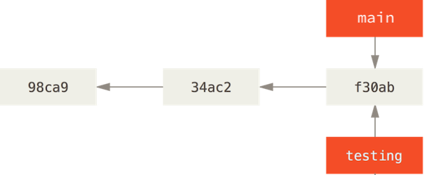
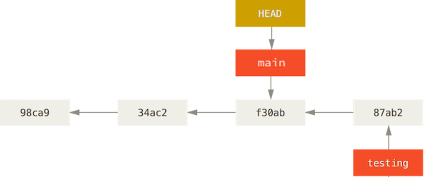
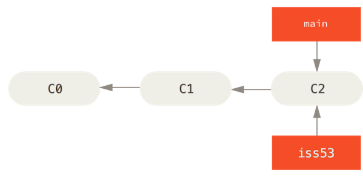
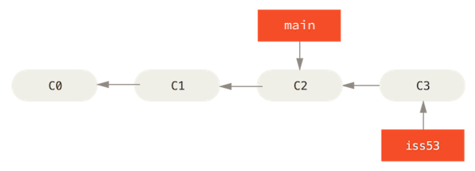
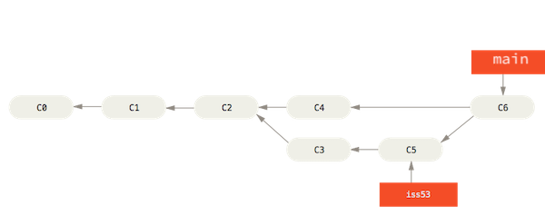

## Git Branching

https://git-scm.com/book/en/v2/Git-Branching-Branches-in-a-Nutshell


---


### Branches in a Nutshell

Git stores data as a series of **snapshots**.

> When you make a commit, Git stores a commit object that contains a pointer to the snapshot of the content you staged. This object also contains the author’s name and email address, the message that you typed, and pointers to the commit or commits that directly came before this commit (its parent or parents): zero parents for the initial commit, one parent for a normal commit, and multiple parents for a commit that results from a merge of two or more branches.

Todo:

- [ ] Show blob, tree and commit objects in `.git` folder.

 

> [!NOTE]
>
> In Git, HEAD refers to the currently checked-out branch's latest commit. 

 


> A branch in Git is simply a lightweight movable pointer to one of these commits. The default branch name in Git is `master`. As you start making commits, you’re given a `master` branch that points to the last commit you made. Every time you commit, the `master` branch pointer moves forward automatically.

> [!NOTE]
>
> The `master` or `main` branch in Git is not a special branch. They are exactly like any other branch. The only reason nearly every repository has one is that the `git init` command creates it by default and most people don't bother to change it.
>
> All new GitHub repositories create a default branch named `main`, and GitHub no longer creates a `master` branch. Run `git config --global init.defaultBranch main` to set default git's default branch to `main`.
>
> https://github.blog/changelog/2020-10-01-the-default-branch-for-newly-created-repositories-is-now-main/

#### Creating a New Branch

What happens when you create a new branch? Well, doing so creates a new pointer for you to move around. Let’s say you want to create a new branch called `testing`. You do this with the `git branch` command:

```console
$ git branch testing
```

This creates a new pointer to the same commit you’re currently on.

 

How does Git know what branch you’re currently on? It keeps a special pointer called `HEAD`. In Git, this is a pointer to the local branch you’re currently on. In this case, you’re still on `main`. The `git branch` command only *created* a new branch — it didn’t switch to that branch.

 


You can easily see this by running a simple `git log` command that shows you where the branch pointers are pointing. This option is called `--decorate`.

 

#### Switching Branches

To switch to an existing branch, you run the `git checkout` command. Let’s switch to the new `testing` branch:

```console
$ git checkout testing
```

This moves `HEAD` to point to the `testing` branch.

 

 

What is the significance of that? Well, let’s do another commit:

```
$ echo 'a new line from testing branch' >> file1.txt
$ git add file1.txt
$ git commit -m 'docs: add a line to file1'
```

 

 

This is interesting, because now your `testing` branch has moved forward, but your `main` branch still points to the commit you were on when you ran `git checkout` to switch branches. Let’s switch back to the `main` branch:

```console
$ git checkout main
```

  

 

> [!NOTE]
>
> `git log` doesn’t show *all* the branches *all* the time
>
> If you were to run `git log` right now, you might wonder where the "testing" branch you just created went, as it would not appear in the output.
>
> The branch hasn’t disappeared; Git just doesn’t know that you’re interested in that branch and it is trying to show you what it thinks you’re interested in. In other words, by default, `git log` will only show commit history below the branch you’ve checked out.
>
> To show commit history for the desired branch you have to explicitly specify it: `git log testing`. To show all of the branches, add `--all` to your `git log` command.

 

> That command did two things. It moved the HEAD pointer back to point to the `main` branch, and it reverted the files in your working directory back to the snapshot that `main` points to. This also means the changes you make from this point forward will diverge from an older version of the project. It essentially rewinds the work you’ve done in your `testing` branch so you can go in a different direction.

> [!NOTE]
>
> Switching branches changes files in your working directory
>
> It’s important to note that when you switch branches in Git, files in your working directory will change. If you switch to an older branch, your working directory will be reverted to look like it did the last time you committed on that branch. If Git cannot do it cleanly, it will not let you switch at all.

Let’s make a few changes and commit again:

```
$ echo 'a new line from main branch' >> file1.txt
$ git add file1.txt
$ git commit -m 'docs: add a line to file1'
```

> Now your project history has diverged (see [Divergent history](https://git-scm.com/book/en/v2/ch00/divergent_history)). You created and switched to a branch, did some work on it, and then switched back to your main branch and did other work. Both of those changes are isolated in separate branches: you can switch back and forth between the branches and merge them together when you’re ready. And you did all that with simple `branch`, `checkout`, and `commit` commands.

 

You can also see this easily with the `git log` command. If you run `git log --oneline --decorate --graph --all` it will print out the history of your commits, showing where your branch pointers are and how your history has diverged.

 

 

> Because a branch in Git is actually a simple file that contains the 40 character SHA-1 checksum of the commit it points to, branches are cheap to create and destroy. Creating a new branch is as quick and simple as writing 41 bytes to a file (40 characters and a newline).
>
> This is in sharp contrast to the way most older VCS tools branch, which involves copying all of the project’s files into a second directory. This can take several seconds or even minutes, depending on the size of the project, whereas in Git the process is always instantaneous. Also, because we’re recording the parents when we commit, finding a proper merge base for merging is automatically done for us and is generally very easy to do. These features help encourage developers to create and use branches often.

> [!NOTE]
>
> Creating a new branch and switching to it at the same time
>
> It’s typical to create a new branch and want to switch to that new branch at the same time — this can be done in one operation with `git checkout -b <newbranchname>`.

> [!NOTE]
>
> From Git version 2.23 onwards you can use `git switch` instead of `git checkout` to:
>
> - Switch to an existing branch: `git switch testing-branch`.
> - Create a new branch and switch to it: `git switch -c new-branch`. The `-c` flag stands for create, you can also use the full flag: `--create`.
> - Return to your previously checked out branch: `git switch -`.


---


### Basic Branching and Merging

https://git-scm.com/book/en/v2/Git-Branching-Basic-Branching-and-Merging

Let’s go through a simple example of branching and merging with a workflow that you might use in the real world. You’ll follow these steps:

1. Do some work on a website.
2. Create a branch for a new user story you’re working on.
3. Do some work in that branch.

At this stage, you’ll receive a call that another issue is critical and you need a hotfix. You’ll do the following:

1. Switch to your production branch.
2. Create a branch to add the hotfix.
3. After it’s tested, merge the hotfix branch, and push to production.
4. Switch back to your original user story and continue working.

#### Basic Branching

First, let’s say you’re working on your project and have a couple of commits already on the `main` branch.

```
echo 'basic branching' > index.html
git add index.html
git commit -m 'C0: create index.html'

echo 'create and use branches often' >> index.html
git add index.html
git commit -m 'C1: add a line to webpage'

echo 'branches are lightweight movable pointer to commits' >> index.html
git add index.html
git commit -m 'C2: add branch definition to webpage'
```

 

 

You’ve decided that you’re going to work on issue #53 in whatever issue-tracking system your company uses. To create a new branch and switch to it at the same time, you can run the `git checkout -b iss53` or `git switch -c iss53`:

```
$ git switch -c iss53
Switched to a new branch 'iss53'
```

> [!NOTE]
>
> This is shorthand for:
>
> ```console
> $ git branch iss53
> $ git checkout iss53
> ```

 

You work on your website and do some commits. Doing so moves the `iss53` branch forward, because you have it checked out (that is, your `HEAD` is pointing to it):

```console
echo '-- branching in git --' >> index.html
git commit -a -m 'Create new footer [issue 53]'
```

 

 

Now you get the call that there is an issue with the website, and you need to fix it immediately. With Git, you don’t have to deploy your fix along with the `iss53` changes you’ve made, and you don’t have to put a lot of effort into reverting those changes before you can work on applying your fix to what is in production. All you have to do is switch back to your `main` branch.

However, before you do that, note that if your working directory or staging area has uncommitted changes that conflict with the branch you’re checking out, Git won’t let you switch branches. It’s best to have a clean working state when you switch branches. There are ways to get around this (namely, stashing and commit amending) that we’ll cover later on, in [Stashing and Cleaning](https://git-scm.com/book/en/v2/ch00/_git_stashing). For now, let’s assume you’ve committed all your changes, so you can switch back to your `main` branch:

```
$ git switch main
Switched to branch 'main'
```

At this point, your project working directory is exactly the way it was before you started working on issue #53, and you can concentrate on your hotfix. 

> [!IMPORTANT]
>
> This is an important point to remember: **when you switch branches, Git resets your working directory to look like it did the last time you committed on that branch**. It adds, removes, and modifies files automatically to make sure your working copy is what the branch looked like on your last commit to it.

Next, you have a hotfix to make. Let’s create a `hotfix` branch on which to work until it’s completed:

```
git switch -c hotfix
echo 'contact john.doe@example.com' >> index.html
git commit -a -m 'C4: Fix broken email address'
```

 

 

You can run your tests, make sure the hotfix is what you want, and finally merge the `hotfix` branch back into your `main` branch to deploy to production. You do this with the `git merge` command:

```
$ git switch main
$ git merge hotfix

Updating 401e4c2..93b0def
Fast-forward
 index.html | 1 +
 1 file changed, 1 insertion(+)
```

You’ll notice the phrase “fast-forward” in that merge. Because the commit `C4` pointed to by the branch `hotfix` you merged in was directly ahead of the commit `C2` you’re on, Git simply moves the pointer forward. To phrase that another way, when you try to merge one commit with a commit that can be reached by following the first commit’s history, Git simplifies things by moving the pointer forward because there is no divergent work to merge together — this is called a “fast-forward.”

Your change is now in the snapshot of the commit pointed to by the `main` branch, and you can deploy the fix.

 

 

After your super-important fix is deployed, you’re ready to switch back to the work you were doing before you were interrupted. However, first you’ll delete the `hotfix` branch, because you no longer need it — the `main` branch points at the same place. You can delete it with the `-d` option to `git branch`:

```
$ git branch -d hotfix
Deleted branch hotfix (was 93b0def).
```

Now you can switch back to your work-in-progress branch on issue #53 and continue working on it.

```
git switch iss53
echo '-= new footer =-' >> index.html
git commit -a -m 'C5: Finish the new footer [issue 53]'
```

 

 

It’s worth noting here that the work you did in your `hotfix` branch is not contained in the files in your `iss53` branch. If you need to pull it in, you can merge your `main` branch into your `iss53` branch by running `git merge main`, or you can wait to integrate those changes until you decide to pull the `iss53` branch back into `main` later.


#### Basic Merging

Suppose you’ve decided that your issue #53 work is complete and ready to be merged into your `main` branch. In order to do that, you’ll merge your `iss53` branch into `main`, much like you merged your `hotfix` branch earlier. All you have to do is check out the branch you wish to merge into and then run the `git merge` command:

```
$ git checkout main
# Or
$ git switch main

$ git merge iss53
```

This looks a bit different than the `hotfix` merge you did earlier. In this case, your development history has diverged from some older point. Because the commit on the branch you’re on isn’t a direct ancestor of the branch you’re merging in, Git has to do some work. In this case, Git does a simple three-way merge, using the two snapshots pointed to by the branch tips and the common ancestor of the two.

 

Instead of just moving the branch pointer forward, Git creates a new snapshot that results from this three-way merge and automatically creates a new commit that points to it. This is referred to as a merge commit, and is special in that it has more than one parent.

 

Now that your work is merged in, you have no further need for the `iss53` branch. You can close the issue in your issue-tracking system, and delete the branch:

```console
$ git branch -d iss53
```


#### Basic Merge Conflicts

Occasionally, this process doesn’t go smoothly. If you changed the same part of the same file differently in the two branches you’re merging, Git won’t be able to merge them cleanly. If your fix for issue #53 modified the same part of a file as the `hotfix` branch, you’ll get a merge conflict that looks something like this:

```
$ git switch main
$ git merge iss53
Auto-merging index.html
CONFLICT (content): Merge conflict in index.html
Automatic merge failed; fix conflicts and then commit the result.
```

 

Git hasn’t automatically created a new merge commit. It has paused the process while you resolve the conflict. If you want to see which files are unmerged at any point after a merge conflict, you can run `git status`:

```
$ git status
On branch main
......
You have unmerged paths.
  (fix conflicts and run "git commit")
  (use "git merge --abort" to abort the merge)

Unmerged paths:
  (use "git add <file>..." to mark resolution)
        both modified:   index.html

no changes added to commit (use "git add" and/or "git commit -a")
```

Anything that has merge conflicts and hasn’t been resolved is listed as unmerged. Git adds standard conflict-resolution markers to the files that have conflicts, so you can open them manually and resolve those conflicts. Your file contains a section that looks something like this:

 

This means the version in `HEAD` (your `main` branch, because that was what you had checked out when you ran your merge command) is the top part of that block (everything above the `=======`), while the version in your `iss53` branch looks like everything in the bottom part. In order to resolve the conflict, you have to either choose one side or the other or merge the contents yourself. For instance, you might resolve this conflict by replacing the entire block with this:

```
-= merged footer =-
```

This resolution has a little of each section, and the `<<<<<<<`, `=======`, and `>>>>>>>` lines have been completely removed. After you’ve resolved each of these sections in each conflicted file, run `git add` on each file to mark it as resolved. Staging the file marks it as resolved in Git.

If you want to use a graphical tool to resolve these issues, you can run `git mergetool`, which fires up an appropriate visual merge tool and walks you through the conflicts:

```
git mergetool
```

 

The screenshot below shows using [Neovim](https://neovim.io/) as merge tool.

 

The screenshot below shows using [Kaleidoscope](https://kaleidoscope.app/) as merge tool.

 

If you want to use a merge tool other than the default (Git chose `opendiff` in this case because the command was run on macOS), you can see all the supported tools listed at the top after “one of the following tools.” Just type the name of the tool you’d rather use.

After you exit the merge tool, Git asks you if the merge was successful. If you tell the script that it was, it stages the file to mark it as resolved for you. You can run `git status` again to verify that all conflicts have been resolved:

```
$ git status
On branch main
Your branch and 'origin/main' have diverged,
and have 8 and 1 different commits each, respectively.
  (use "git pull" if you want to integrate the remote branch with yours)

All conflicts fixed but you are still merging.
  (use "git commit" to conclude merge)

Changes to be committed:
        modified:   index.html
```

If you’re happy with that, and you verify that everything that had conflicts has been staged, you can type `git commit` to finalize the merge commit. The commit message by default looks something like this:

```
$ # git commit will launch the default editor
$ git commit
```

 

If you think it would be helpful to others looking at this merge in the future, you can modify this commit message with details about how you resolved the merge and explain why you did the changes you made if these are not obvious.

 

The screenshot below shows using [Fork](https://git-fork.com/) to check merged branches.

 


### Branch Management

